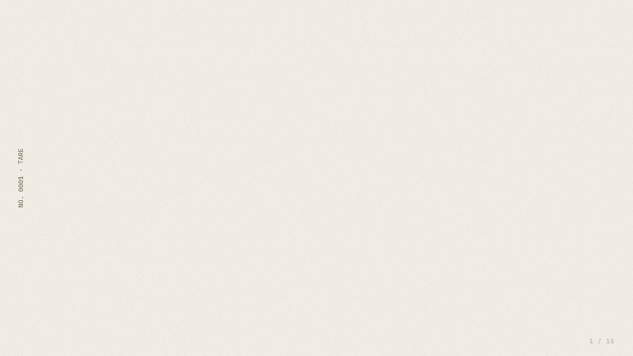
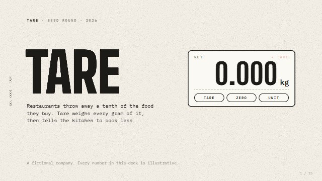
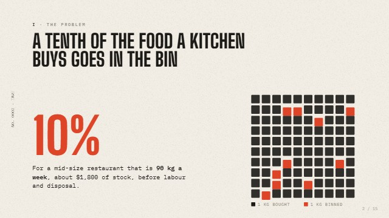
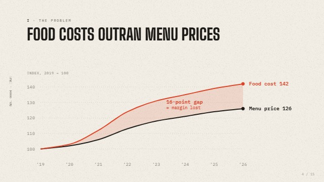
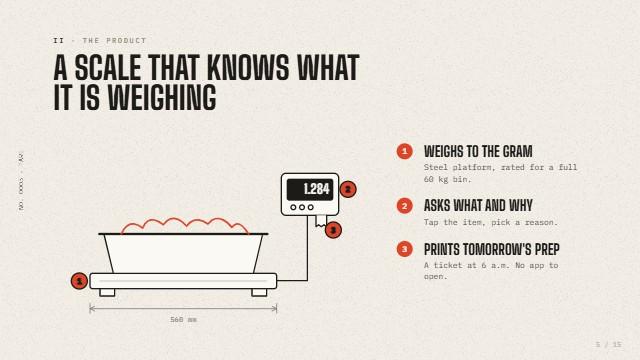
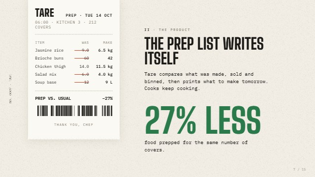
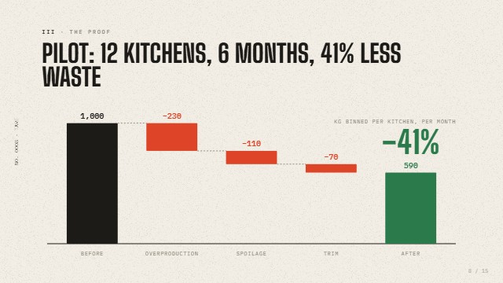
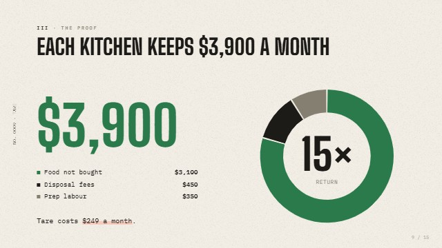
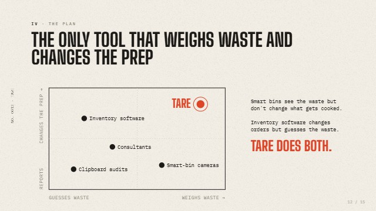
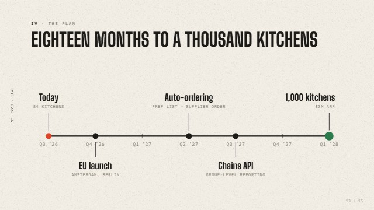

<div align="center">

# deck-kit

**Every slide is code.** A kit an AI agent follows to build presentations as code:<br>
pitch decks, product launches, proposals and talks with animated charts, diagrams and cinematic transitions,<br>
in one HTML file, with a presenter view and PDF / PPTX exports.



<sub>No templates, no images: the whole deck is one HTML file that computes every frame.<br>
Source: <a href="examples/demo/deck.html">examples/demo/deck.html</a> · storyline: <a href="examples/demo/SCRIPT.md">examples/demo/SCRIPT.md</a></sub>

[](LICENSE)
[](SKILL.md)


</div>

## Why

Ask a model for a presentation and you get the same deck every time: a dark gradient, three icon cards, bullet lists, topic titles like "Market", charts from a library with a legend nobody reads, and a fade between every slide. Or you get a .pptx that looks like 2012.

deck-kit is a set of rules and recipes that closes those gaps, plus a small runtime. The architectural idea: **the deck is a pure function of `(slide, step, t)`**. Everything follows from it:

- **one source, every format.** The HTML deck animates; its rest frames become a vector PDF and a PPTX with speaker notes; its timeline becomes a GIF or MP4;
- **exact jumps.** `#7.2`, the overview, presenter view and the clicker land on a precise state with no replay;
- **checks a machine can run.** Every rest frame, and every moment of every animation, is linted for text escaping its box, tiny text, overlaps and the safe area, with and without webfonts, and laid out on a contact sheet for review;
- **cheap to run.** A slide that has finished animating stops rendering; a still slide costs almost nothing, even on battery;
- **edits in one line.** Change an easing, a colour or a number, re-export, and get the same deck with one difference.

## What the demo shows

Tare is a seed pitch for a fictional product, a scale that weighs kitchen food waste. 15 slides, built strictly by this kit. The style comes from the subject: thermal receipt paper, red for waste, green for saved, and nothing else in colour.

<table>
<tr>
<td width="33%"><br><b>A motif, not a template</b><br><sub>The scale tares a full pan to 0.000. <a href="04-slide-design.md">04</a> · <a href="09-typography.md">09</a></sub></td>
<td width="33%"><br><b>One in ten, literally</b><br><sub>A unit chart builds in a wave, then ten kilos go red. <a href="07-charts.md">07</a></sub></td>
<td width="33%"><br><b>The gap is the point</b><br><sub>Lines draw, the gap fills, the click names it. <a href="07-charts.md">07</a> · <a href="05-motion.md">05</a></sub></td>
</tr>
<tr>
<td><br><b>Drawn like a blueprint</b><br><sub>Line art draws itself; badges match callouts. <a href="08-diagrams.md">08</a></sub></td>
<td><br><b>Zoom into the ticket</b><br><sub>It prints, then strikes yesterday and counts today. <a href="06-transitions.md">06</a></sub></td>
<td><br><b>One cause per click</b><br><sub>A waterfall that argues step by step. <a href="07-charts.md">07</a> · <a href="03-story.md">03</a></sub></td>
</tr>
<tr>
<td><br><b>The number, then the return</b><br><sub>Count-up, donut, the ROI lands in the hole. <a href="07-charts.md">07</a></sub></td>
<td><br><b>Categories, not companies</b><br><sub>Dots in a stagger, ours lands last. <a href="08-diagrams.md">08</a></sub></td>
<td><br><b>A plan that runs</b><br><sub>The line reaches one milestone per click. <a href="08-diagrams.md">08</a></sub></td>
</tr>
</table>

Transitions carry meaning: the **camera** feeds down the receipt inside a chapter, the receipt is **torn off** between chapters, the device **morphs** into a diagram node, and a **zoom** dives from that node into the printed ticket.

See it live: open [`examples/demo/deck.html`](examples/demo/deck.html) in Chrome. Click or press → to advance; move the mouse for the control bar (slide title, step dots, a scrubber to jump anywhere); **O** or **Esc** for all slides, **P** for presenter view, **?** for shortcuts.

## Quick start

deck-kit is a skill in the open [Agent Skills](https://agentskills.io) format: a folder with a `SKILL.md`. The same skill works in Claude and in ChatGPT; only the install location differs.

| Where | How |
|---|---|
| **Claude Code** | `git clone https://github.com/kiselas/every-slide-is-code ~/.claude/skills/deck-kit` |
| **Codex** (CLI, IDE, app) | `git clone https://github.com/kiselas/every-slide-is-code ~/.agents/skills/deck-kit` |
| **ChatGPT** | download [deck-kit.zip](https://github.com/kiselas/every-slide-is-code/releases/latest/download/deck-kit.zip), then Plugins → Skills → Create → Upload from computer |
| **Claude.ai / Claude Desktop** | the same [deck-kit.zip](https://github.com/kiselas/every-slide-is-code/releases/latest/download/deck-kit.zip), then Customize → Skills → Upload |

For one project, clone into `.claude/skills/deck-kit` or `.agents/skills/deck-kit` inside the repository. The agent picks the skill up when the task is a presentation. To call it explicitly: `/deck-kit` in Claude Code, `$deck-kit` in Codex, `@deck-kit` in ChatGPT. Try:

```
Seed pitch for a service that turns hospital discharge notes into a plan the patient understands.
10 slides, 6 minutes, illustrative numbers. Derive the style from the subject.
Show the titles first, then the plan with charts and transitions, then build it,
run check and the contact sheet, and fix what you see.
```

Exports and checks need Node and Chrome, so they run where the agent has a terminal (Claude Code, Codex). In ChatGPT and Claude.ai the skill plans and writes the deck; run the export commands below yourself.

**Without skill support.** Copy the folder to `docs/deck-kit/` and add to `CLAUDE.md` or `AGENTS.md`:

```
Before building any presentation, read docs/deck-kit/00-agent-brief.md, then the files relevant to the task,
and start from docs/deck-kit/template/deck.html.
```

In a plain chat, attach `00-agent-brief.md`, `01-runtime.md` and `template/deck.html`.

## Export and check

```bash
cd export && npm install
node deck.mjs check ../my-deck.html                 # lint every rest frame
node deck.mjs check ../my-deck.html --timeline --no-webfonts   # mid-animation, fallback fonts
node deck.mjs perf  ../my-deck.html                 # frame cost per slide and transition
node deck.mjs sheet ../my-deck.html sheet.png       # contact sheet for review
node deck.mjs pdf   ../my-deck.html deck.pdf        # vector, selectable text
node deck.mjs pptx  ../my-deck.html deck.pptx       # static slides + speaker notes
node deck.mjs gif   ../my-deck.html teaser.gif --hold 1.2 --to 30
node deck.mjs bundle ../my-deck.html offline.html   # fonts and CDN scripts inlined
```

Needs Node 18+ and Google Chrome; MP4 also needs ffmpeg. PDF and PPTX are deliberately static: PDF viewers do not play animation outside Acrobat, so every build's final state is designed to read on its own. Details in [12-export-qa.md](12-export-qa.md).

## Contents

| File | About |
|---|---|
| [00-agent-brief.md](00-agent-brief.md) | Condensed rules for the agent. The main file |
| [01-runtime.md](01-runtime.md) | Architecture, markup and JS reference, modes, gotchas |
| [02-prompting.md](02-prompting.md) | How to brief a deck, templates, phrases for iteration |
| [03-story.md](03-story.md) | Action titles, structures (pitch, SCQA, keynote), evidence |
| [04-slide-design.md](04-slide-design.md) | Grid, palettes with roles, density, layouts |
| [05-motion.md](05-motion.md) | What motion is for, easing, timing, builds |
| [06-transitions.md](06-transitions.md) | Transitions as meaning, catalogue, camera world, morph |
| [07-charts.md](07-charts.md) | Choosing a chart, honest charts, animated recipes |
| [08-diagrams.md](08-diagrams.md) | Flows, loops, architecture, timelines, blueprints |
| [09-typography.md](09-typography.md) | Pairings, sizes, kinetic type that earns its place |
| [10-stage.md](10-stage.md) | A world behind the slides: grain, parallax, marks between slides |
| [11-presenting.md](11-presenting.md) | Keys, presenter view, the room, what to send |
| [12-export-qa.md](12-export-qa.md) | Formats, check, contact sheet, transition strips, checklist |
| [13-performance.md](13-performance.md) | What the runtime optimises, rules for deck code, measuring |
| [runtime/](runtime/) | `deck.js` and `deck.css`, inlined into every deck |
| [template/deck.html](template/deck.html) | Starter deck: builds, count, bars, line, flow, morph |
| [export/](export/) | Exporter and linter (Node + Playwright) |
| [examples/demo/](examples/demo/) | The Tare pitch: deck and storyline |
| [scripts/](scripts/) | `sync-runtime.mjs` (new deck, refresh runtime), `pack-skill.sh` (zip for ChatGPT and Claude.ai; a `vX.Y.Z` tag builds it in CI) |
| [sources.md](sources.md) | Sources and further reading |

## Contributing

Pull requests are welcome: new chart and diagram recipes, transitions, prompts that worked for you (with a contact sheet), fixes to the runtime. Run `node export/deck.mjs check` on the template and the demo before sending.

## License

MIT
